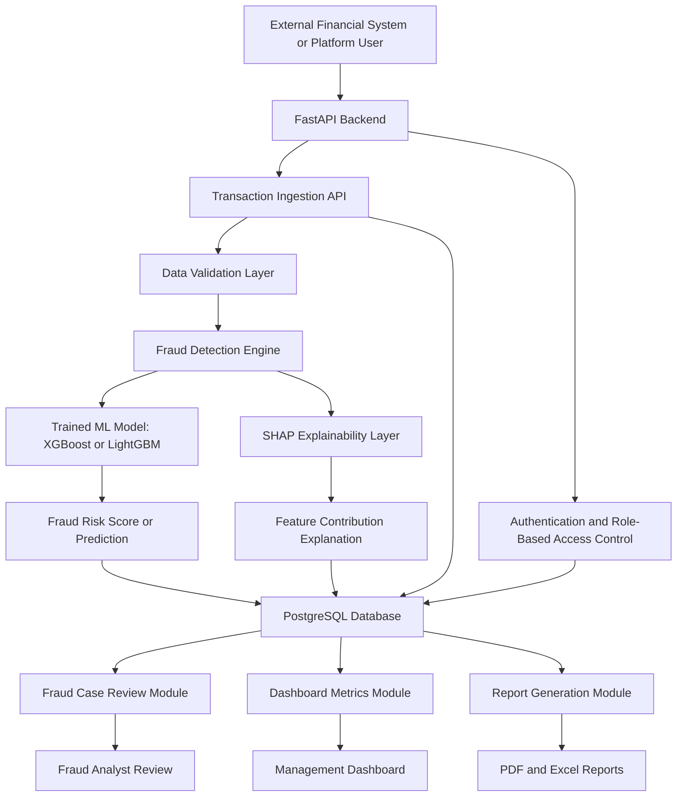

# Step 4: Architecture Design

The JustCorp Sentinel AI platform will adopt a modular monolith architecture. This approach involves building the system as a single backend application while separating its internal responsibilities into distinct modules such as authentication, transaction ingestion, fraud scoring, explainability, database storage, case review, dashboard metrics, and report generation.

This architectural choice suits the project because it is easier to build, test, and deploy than a microservices approach while still supporting good software engineering practices. It keeps the platform maintainable, testable, and sufficiently scalable for a final-year AI and Machine Learning project, portfolio showcase, and eventual SaaS productisation.

The system will enable users or external financial systems to submit transaction data through a FastAPI backend. The backend will validate incoming data and forward it to the fraud detection engine. The fraud detection engine will use a trained machine learning model such as XGBoost or LightGBM to produce a fraud risk score or prediction. The explainability layer will then apply SHAP to identify which transaction features most influenced the prediction.

Once scoring and explanation are complete, the platform will store the transaction record, prediction result, explanation output, timestamp, and associated user actions in a PostgreSQL database. Authorised users will be able to review suspicious transactions, update investigation statuses, add analyst comments, access dashboard metrics, and generate PDF or Excel reports for investigation and management review.

## Architecture Diagram

## Major System Components

### 1. User Interface Layer

This layer will provide fraud analysts, risk officers, managers, auditors, and administrators with the means to interact with the platform.

### 2. API Layer

This layer will expose endpoints for authentication, transaction submission, fraud scoring, case review, dashboard metrics, and report generation.

### 3. Machine Learning Layer

This layer will manage preprocessing, model loading, fraud prediction, and model-related outputs.

### 4. Explainability Layer

This layer will produce SHAP-based explanations showing why a transaction was flagged as suspicious or classified as low risk.

### 5. Database Layer

This layer will store users, transactions, predictions, explanations, case review records, generated reports, and audit logs.

### 6. Reporting Layer

This layer will generate structured fraud reports for analysts, managers, and audit review.

The selected architecture supports the project’s goal of delivering an explainable, audit-ready, API-accessible fraud intelligence platform that can later be extended into a SaaS-ready product.
